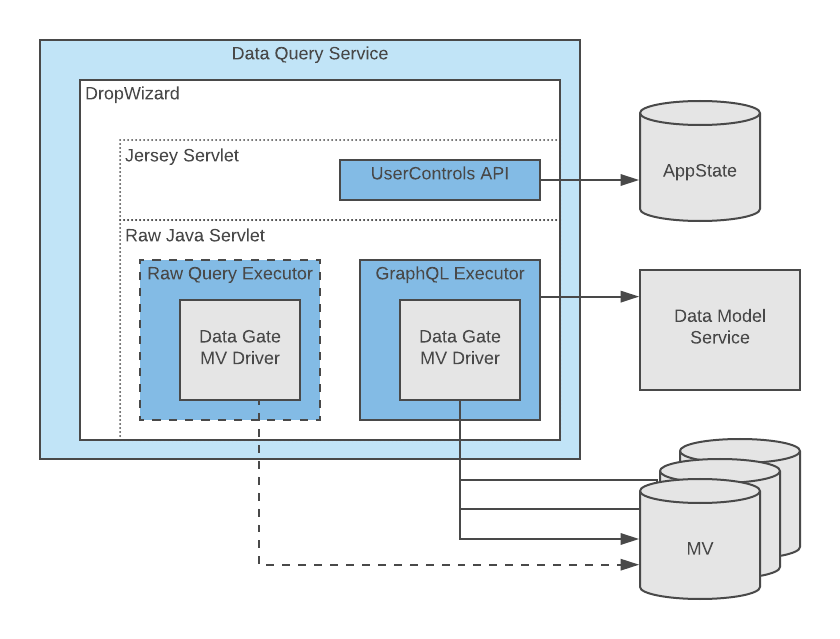
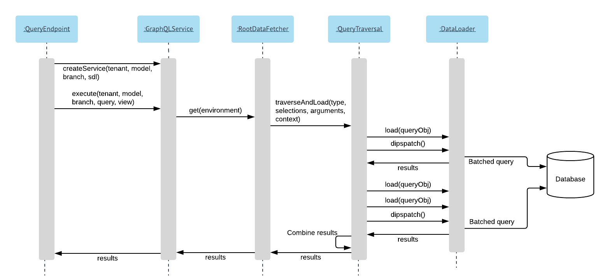
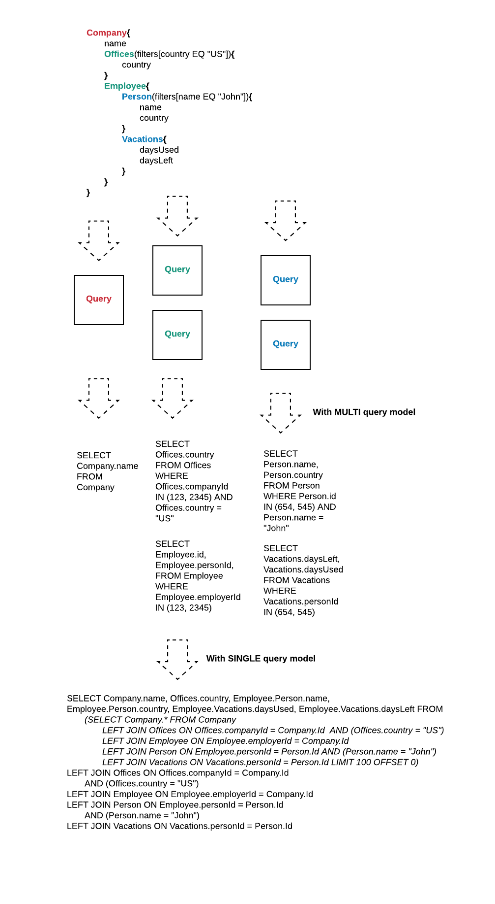

# Architecture

DM Data Query Service provides a generic GraphQL query API that works across all Data Management Materialized Views. 

Data Query Service uses [Data Gate Libraries](https://github.com/LiaisonTechnologies/dm-datagate) to connect to Materialized Views and Data Model Service to convert models to GraphQL SDLs. 



The service is a Dropwizard Java application that provides the HTTP APIs. The query and mutation APIs should use raw Java servlets instead of the Jersey servlets the DropWizard examples use. This should significantly improve performance and minimize the overhead caused by the service but still allow us to use a framework familiar to the development team. [Tuning Dropwizard Performance](https://nbsoftsolutions.com/blog/turning-dropwizard-performance-up-to-eleven).

### Raw Queries

As the first phase Query Service provides an endpoint for running HBase queries without a GraphQL schema.

#### HBASE

HBase has no built-in query language and the Query Service will use Java libraries to connect to HBase. Instead of a GraphQL query the request body will be a JSON as follows:

```
{
"table": "table_name",
"rowKeys": ["row_key_1", "row_key_2"],
"where": [{"family": "column_family_name", column": "column_name", "value": "data_value"}],
"select": [{
  "family": "column_family_name",
  "column": "column_name",
  "convertTo": "string"
  }]
}
```

A Get query will be run if rowKeys is populated and a Scan query if where conditions are provided. Only either one is allowed, not both at the same time.

### GraphQL Queries

The core functionality of Query Service is to execute GraphQL queries against DM Materialized Views.

Materialized Views are built based on DM Data Models and they are also used to define the GraphQL schemas. Materialized View implementation specific queries can be built using these GraphQL schemas (SDL). 


A simple highlevel Data Model could be defined as:

```
Person 1 ------- * Address
-name              -street
                   -zip
                   -state
``` 

This business model would be parsed into a SDL with the corresponding types:

``` 
type Person{
    id: ID!
    name: String!
    addresses(filterset: _FilterSet): [Address] @relationship(parentKeyFieldName: "id" childKeyFieldName: "personId")
    dq_aggregation_result: Float
}

type Address{
    id: ID!
    personId: Int
    street: String!
    zip: Int!
    state: String!
    person: Person @relationship(parentKeyFieldName: "personId" childKeyFieldName: "id")
    dq_aggregation_result: Float
}
``` 

To enable building joins for any Data Model types some additional information was added on the `addresses` and `person` relationships.  `@relationship` directive tells Query Service which fields in the parent and child types are used to realize the join. When joining multiple types, a filterset can be provided to further filter the join.

Additionally the SDL schema should contain a standard query type `_GraphQLQuery` and four query methods for each type: (type)_scroll, (type)_by_id, (type)_query and (type)_aggregate.


```
directive @relationship(parentKeyFieldName: String!
                         childKeyFieldName: String!
                         bridgeName: String
                         parentBridgeKeyFieldName: String
                         childBridgeKeyFieldName: String) on FIELD_DEFINITION

schema {
    query: _GraphQLQuery
}

type _GraphQLQuery{
    Person_scroll(skip: Int limit: Int sort: _Sort) : [Person]
    Person_by_id(id: ID!) : Person
    Person_query(filterset: _FilterSet! skip: Int limit: Int sort: _Sort) : [Person]
    Person_aggregate( filterset: _FilterSet sort: _Sort aggregate: _Aggregate! ) : [Person]

    Address_scroll(skip: Int limit: Int sort: _Sort) : [Address]
    Address_by_id(id: ID!) : Address
    Address_query(filterset: _FilterSet! skip: Int limit: Int sort: _Sort) : [Address]
    Address_aggregate( filterset: _FilterSet sort: _Sort aggregate: _Aggregate! ) : [Address]
}

enum _ComparisonOperator { EQ NE LT LE GT GE LIKE IN } 
enum _LogicalOperator { AND OR } 
enum _Dir {ASC DESC}
enum _Aggregate { COUNT }

input _Filter {
    field : String!
    op : _ComparisonOperator!
    value : String!
    not : Boolean
}

input _FilterSet {
    filtersets : [_FilterSet]
    filters : [_Filter]
    op : _LogicalOperator
    not: Boolean
}

input _Sort {
   field: String!
   direction: _Dir
}

<data model specific types>
```

Query Service uses the SDL schemas to build GraphQL objects that get wired with MV specific resolvers in runtime. A sequence graph showing component interaction when executing a GraphQL query:




#### RDBMS Loader

There are two query models available: simple MULTI query model where each nested object (relationship) is a separate SQL query, and a more complex SINGLE model where just a single SQL is generated for the SQL. Simplified query examples below.



The SINGLE query model uses a sub query in order to apply row limit and offset on the root object type. 

In addition, the SINGLE model provides filters that can be applied on nested structures on the top level object. See the User Guide for details.


#### ArangoDB Loader

As ArangoDB is (also) a document store the nested objects and arrays may be included in the document itself or they may represent a relationship to another document. The `@relationships` directive needs to be present whenever the object/array is referring to document(s) in another collection, otherwise a nested Json element is assumed. `bridgeName` defines the vertex collection name, where `parentBridgeKeyFieldName` is always *_from* and `childBridgeKeyFieldName`is always *_to*. 

TODO..

#### HBASE Loader

TODO..

### GraphQL Mutations

TODO..
